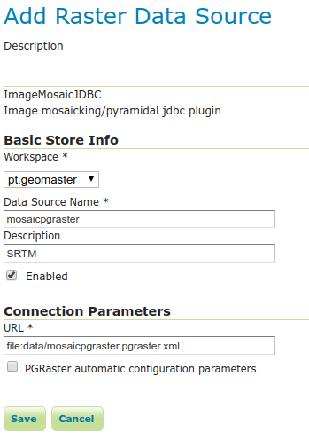
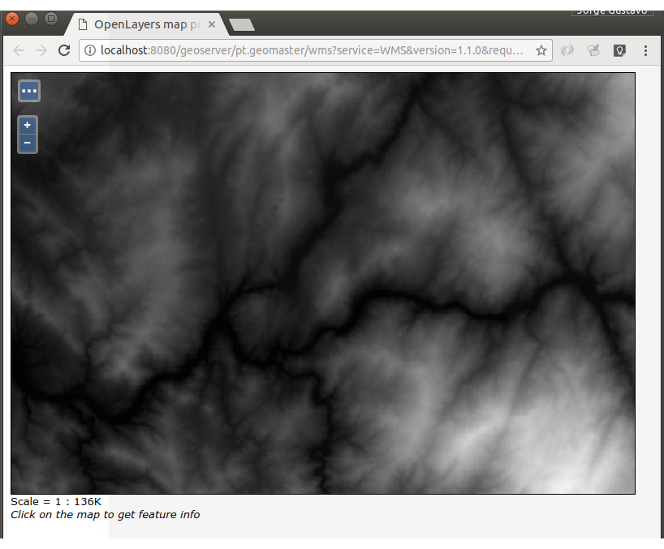

### Previous setup

We already have `srtm_1arc_v3.tif` raster on the `postgis_raster` database, in the `rasters.dem` table.
The import was done using:
```bash
raster2pgsql -s 3763 -N -32767 -t 100x100 -I -C -M -d srtm_1arc_v3.tif rasters.dem | psql -d postgis_raster -h localhost -U geobox -p 5432
```

## Install GeoServer PGRaster community module

We will need the [GeoServer PGRaster community module](http://docs.geoserver.org/maintain/en/user/community/pgraster/pgraster.html).

Download and install the version for your current GeoServer installation.

```bash
cd /var/lib/tomcat7/webapps/geoserver/WEB-INF/lib
sudo unzip ~/Transferências/geoserver-2.10-SNAPSHOT-pgraster-plugin.zip
```

Restart Geoserver.

## Configure ImageMosaicJDBC store

### Step 1: configuration files

We need some configuration files for the ImageMosaicJDBC plugin.

Put these files in our `GEOSERVER_DATA_DIR/data`.
 
File `connect.pgraster.xml.inc`

```xml
<connect>
   <dstype value="DBCP"/>
   <username value="geobox"/>
   <password value="geobox"/>
   <jdbcUrl value="jdbc:postgresql://localhost:5432/postgis_raster"/>
   <driverClassName value="org.postgresql.Driver"/>
   <maxActive value="10"/>
   <maxIdle value="0"/>
</connect>
```

File `mapping.pgraster.xml.inc`

```xml
<spatialExtension name="pgraster"/>
 <mapping>
      <masterTable name="mosaic" >
              <coverageNameAttribute name="name"/>
              <maxXAttribute name="maxX"/>
              <maxYAttribute name="maxY"/>
              <minXAttribute name="minX"/>
              <minYAttribute name="minY"/>
              <resXAttribute name="resX"/>
              <resYAttribute name="resY"/>
              <tileTableNameAtribute name="tiletable" />
      </masterTable>
      <tileTable>
              <blobAttributeName name="rast" />
      </tileTable>
</mapping>
```

File `mosaicpgraster.pgraster.xml`

```xml
<?xml version="1.0" encoding="UTF-8" standalone="no"?>
<!DOCTYPE ImageMosaicJDBCConfig [
      <!ENTITY mapping PUBLIC "mapping"  "mapping.pgraster.xml.inc">
      <!ENTITY connect PUBLIC "connect"  "connect.pgraster.xml.inc">
]>

<config version="1.0">
      <coverageName name="oek"/>
      <coordsys name="EPSG:3763"/>
      <scaleop  interpolation="1"/>
      <axisOrder ignore="false"/>
      &mapping;
      &connect;
</config>
```

### Step 2: Supporting tables and data

We some one additional table on our `postgis_raster` database.

```sql
CREATE TABLE public.mosaic (
    name character varying(254) COLLATE pg_catalog."default" NOT NULL,
    tiletable character varying(254) COLLATE pg_catalog."default" NOT NULL,
    minx double precision,
    miny double precision,
    maxx double precision,
    maxy double precision,
    resx double precision,
    resy double precision,
    CONSTRAINT mosaic_pkey PRIMARY KEY (name, tiletable)
);
```

Add our table to this matadata table:

```sql
insert into mosaic (name,tiletable) values ('mosaicpgraster','rasters.dem');
```

### Step 3: Create a new datastore

Create a new ImageMosaicJDBC store.

For the URL, use the file we created: `file:data/mosaicpgraster.pgraster.xml`.



Save it.

### Step 4: Create a new layer from the store

### Step 5: Preview the layer




